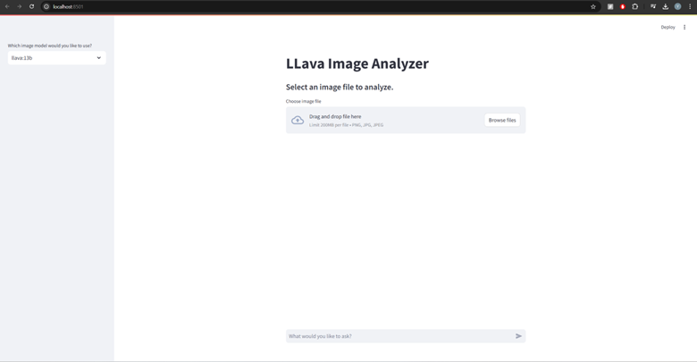
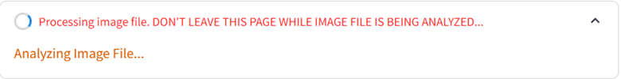

# AI Image Analyzer

AI Image Analyzer is a powerful application that combines cutting-edge AI models to analyze images and provide interactive, insightful responses. Users can upload images, select from multiple vision models, and ask tailored questions to explore the content of their images. Built with Ollama and Streamlit, this tool offers an intuitive and engaging experience for AI-driven image analysis.

## Features
- **Image Analysis**: Seamlessly upload images and let the AI provide detailed insights.
- **Vision Model Selection**: Choose from multiple AI models to perform tailored image analysis.
- **Interactive Chat**: Engage in conversations with the AI to ask specific questions about the uploaded image.

## How It Works
1. **Upload an Image**: Select any image in supported formats (PNG, JPG, JPEG).
     
2. **Choose a Model**: Pick from available AI models for custom analysis.
   - *Screenshot Placeholder: Model Selection*
3. **Ask a Question**: Interact with the AI chatbot to gain a deeper understanding of the image.
     
4. **Receive Insights**: Get detailed and accurate responses from the AI based on your questions.
     

This project leverages cutting-edge AI to provide an intuitive, interactive, and highly engaging image analysis experience.
